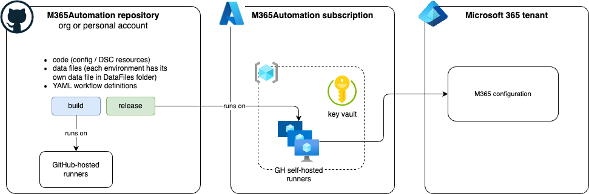

# M365Ops-Accelerator
Enables integration of M365Dsc with GitHub to deliver GitOps-based M365 management.

## Overview

## Pipelines
1. **Build workflow** - responsible for running the Build script (compiles DSC config into a MOF file)
   - preps the runner, reads data files
   - retrieves info from AKV
   - compiles MOF file -> output folder with: 1. MOF files, 2. Deployment script (ps1), 3. DSCResources.psd1
   - packages output to .ZIP and publishes the artifact
2. **Release workflow** - deployes the DSC config to an environment
   - uses Build artifacts
   - preps the self-hosted agent (install M365 AuthN certificat, install M365DSC and dependent modules)
3. **Compliance workflow** - uses Build artifacts to check if environment is still compliant -> runs compliance check and creates a summary report + sends an email or a Teams channel message

## Other notes
- DSC
  - composite resources (one DSC resource per M365 workload) - each composite resource contains all DSC resources for that workload
  - one main DSC Config = M365Configuration.ps1 - responsible for calling each of the composite resources
  - M365Config module - included in the scripts, contains a coposite resource for each workload
- Environments
  - e.g., Production, Acceptance
  - one M365 account and App registration in each tenant
  - add a data file to DataFiles folder for each tenant + update correct info
  - add secrets in AKV for that tenant (env.)
  - add new stage to the Release pipeline (Environment parameter), use Azure POSH step
